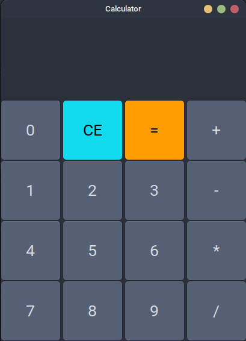

# GTK-Calci

A simple calculator application built using GTK and Python. This app provides basic arithmetic operations like addition, subtraction, multiplication, and division with an intuitive graphical interface.

## Features

- **Basic Arithmetic Operations**: Addition, subtraction, multiplication, and division.
- **User-Friendly Interface**: Simple and clean layout for ease of use.
- **Cross-Platform**: Compatible with Linux, macOS, and Windows.

## Prerequisites

Make sure you have the following installed on your system:

- Python 3.x
- GTK 3.x
- PyGObject

You can install the required Python package with:

```bash
pip install pygobject
```

## Installation

1. Clone the repository:

   ```bash
   git clone https://github.com/jignesh119/gtk-calci.git
   cd gtk-calci
   ```

2. Run the application:
   ```bash
   python3 main.py
   ```

## Usage

1. Enter the numbers and select the operation using the buttons.
2. Click on `=` to display the result.
3. Use the `C` button to clear the input.

## Screenshot



## License

This project is licensed under the MIT License - see the [LICENSE](LICENSE) file for details.

## Contributing

Feel free to submit issues or pull requests. Contributions are welcome!
